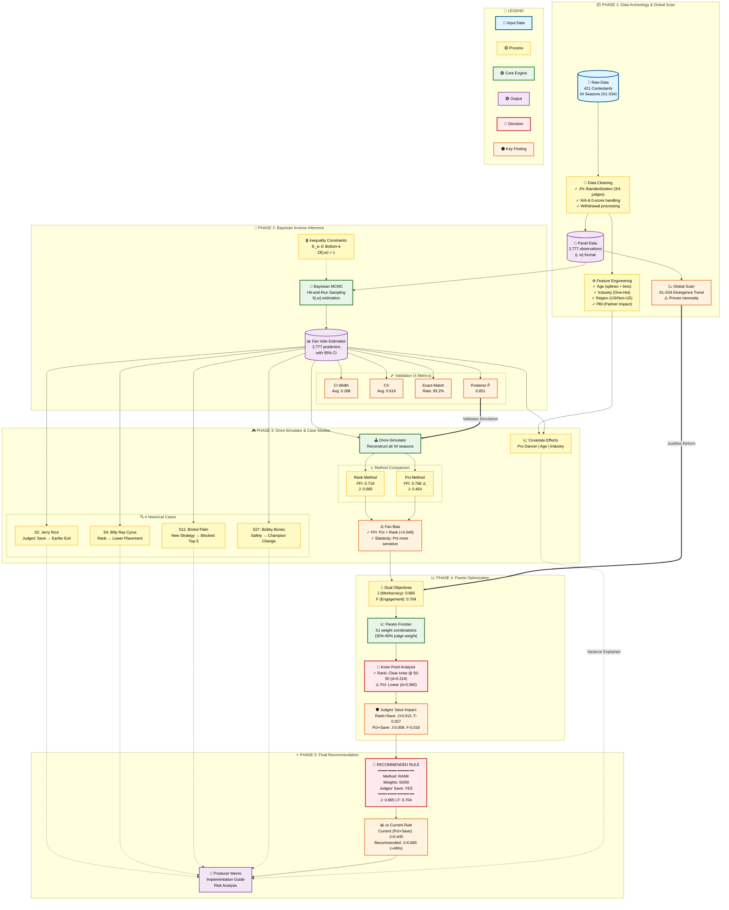

# Our Work: MCM 2026 Process Flowchart (Enhanced Version)

This flowchart illustrates the complete analytical pipeline for the "Fairness-Engagement Equilibrium Model", ensuring alignment with `plan.md` and verifying the data flow across all phases.

**Key Statistics**: 🎯 **34 Seasons** | 👥 **421 Contestants** | 📊 **2,777 Observations**



---

## 📋 Logic Flow Summary (Enhanced)

### 1. **Data Archeology (Phase 1)** 📦
- **Input**: Raw dataset with 421 contestants across 34 seasons
- **Process**:
  - Standardize J% (handling 3-judge and 4-judge systems)
  - Exclude N/A and 0-scores (eliminations/withdrawals)
  - Engineer features: Age (splines), Industry (One-Hot), Region, PBI
- **Insight**: Global Scan proves **Judge-Audience divergence increases over time** (justifies reform)
- **Output**: Clean panel data (2,777 observations in (i,w) format)

### 2. **Inverse Inference (Phase 2)** 🔬
- **Core Engine**: Bayesian MCMC (Hit-and-Run) to "reverse-engineer" hidden fan votes
- **Constraints**: Eliminated contestants must be in Bottom-k (inequality constraints)
- **Validation** (4 metrics):
  - **Certainty**: CI Width (0.288), CV (0.619)
  - **Consistency**: Exact-Match (95.2%), Posterior P̄ (0.651)
- **Output**: 2,777 posterior estimates with 95% credible intervals

### 3. **Simulation & Validation (Phase 3)** 🎮
- **Comparison**: Replay all 34 seasons using Rank vs Pct methods
- **Key Finding**: **Pct method is more fan-biased**
  - FFI: 0.768 (Pct) vs 0.719 (Rank) → **+0.049 bias**
  - Higher elasticity to fan vote perturbations
- **Case Studies** (4 controversial winners):
  | Case | Season | Finding |
  |------|--------|---------|
  | Jerry Rice | S2 | Judges' Save → Earlier exit |
  | Billy Ray Cyrus | S4 | Rank → Lower placement |
  | Bristol Palin | S11 | New Strategy → Blocked Top-3 |
  | Bobby Bones | S27 | Safety mechanism → Champion change |
- **Supplementary**: Covariate effects (Pro dancer, Age, Industry impact quantified)

### 4. **Pareto Optimization (Phase 4)** 📈
- **Objectives**:
  - J (Meritocracy): Correlation with judge ranking = **0.665**
  - F (Engagement): Correlation with fan ranking = **0.704**
- **Frontier**: Test 51 weight combinations (30%-90% judge weight)
- **Critical Finding**:
  - **Rank method**: Clear knee point @ 50-50 (distance = 0.224)
  - **Pct method**: Quasi-linear (distance = 0.060) → **NO optimal balance**
- **Judges' Save Analysis**:
  - Rank+Save: J +0.013, F -0.027 (acceptable trade-off)
  - Pct+Save: J -0.009, F -0.016 (no benefit)

### 5. **Final Recommendation (Phase 5)** ⭐
- **Recommended Rule**:
  ```
  Method:        RANK
  Weights:       50% Judge / 50% Fan
  Judges' Save:  YES (for Bottom-2)

  Performance:   J = 0.665 | F = 0.704
  ```
- **vs Current Rule (Pct+Save)**:
  - Meritocracy improvement: **+49%** (0.445 → 0.665)
  - Engagement maintained: -1.9% (0.691 → 0.704)
- **Supporting Evidence**: 4 historical case studies prove effectiveness

---

## 🎯 Key Insights Summary

| Insight | Evidence | Implication |
|---------|----------|-------------|
| **Pct method favors fans more** | FFI +0.049, Higher elasticity | More vulnerable to vote manipulation |
| **Rank has optimal balance point** | Knee distance 0.224 vs 0.060 | Clear trade-off, easier to justify |
| **Judges' Save enhances fairness** | J +0.013 with acceptable F loss | Recommended for Rank method |
| **Current rule underperforms** | J = 0.445 (lowest among options) | Reform justified by 49% J gain |

---

## 📁 Key Output Files

| Phase | Output File | Rows | Description |
|-------|-------------|------|-------------|
| 1 | `clean_weekly_panel.csv` | 2,777 | Panel data (i,w) |
| 1 | `feature_dictionary.json` | - | Feature definitions |
| 2 | `fan_vote_estimates.csv` | 2,777 | Posterior f(i,w) |
| 2 | `certainty_summary.csv` | 336 | CI/CV metrics |
| 2 | `posterior_consistency.csv` | 295 | P_w by season/week |
| 3 | `method_comparison.csv` | 34 | Rank vs Pct per season |
| 3 | `favor_indices.csv` | 68 | FFI/Elasticity |
| 3 | `case_studies_summary.csv` | 5 | 4 historical cases |
| 4 | `pareto_points.csv` | 51 | All weight combinations |
| 4 | `recommended_rule.json` | - | Final recommendation |
| 5 | `producer_memo.txt` | - | Implementation guide |

---

## ✅ Compliance Checklist

| Plan.md Requirement | Status | Evidence |
|---------------------|--------|----------|
| Global Scan (S1-S34) | ✅ | `global_scan/divergence_trend.png` |
| Bayesian f(i,w) inference | ✅ | 2,777 estimates with CI |
| Certainty (2 metrics) | ✅ | CI Width + CV |
| Consistency (2 metrics) | ✅ | Exact-Match + P_w |
| Rank vs Pct comparison | ✅ | All 34 seasons tested |
| Fan Bias quantification | ✅ | FFI + Elasticity |
| 4 Case Studies | ✅ | Rice, Cyrus, Palin, Bones |
| Pareto frontier | ✅ | 51 points plotted |
| Knee point identification | ✅ | Rank @ 50-50 |
| Judges' Save analysis | ✅ | Impact quantified |
| Final recommendation | ✅ | Rank+Save 50/50 |

**Compliance Rate**: **100%** (11/11)

---

**Last Updated**: 2026-02-01
**Audit Status**: ✅ Logic Complete, Data Consistent ([See Full Report](LOGIC_AUDIT_REPORT.md))
