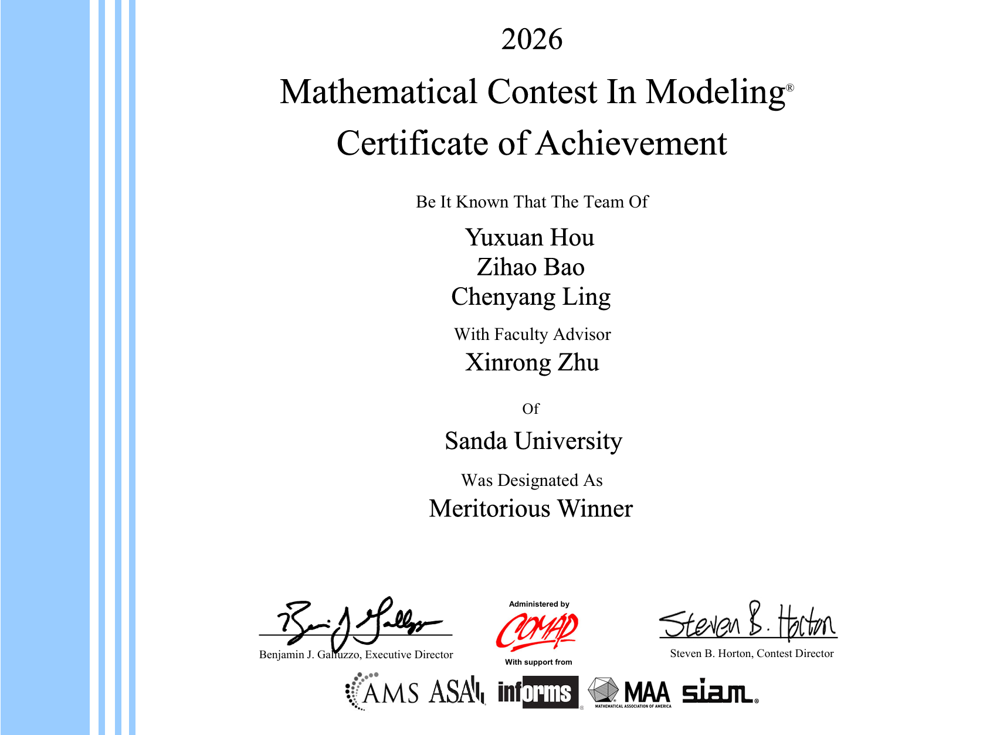

# MCM-2026-Problem-C

本项目是 2026 MCM/ICM C 题的完整建模与分析工程，围绕 DWTS（Dancing With The Stars）投票机制优化问题，构建了从数据清洗、贝叶斯反推、规则仿真到策略推荐的全流程方法。

## 项目简介

- 研究目标：在“公平性（技术表现）”与“参与度（观众偏好）”之间寻找更优平衡。
- 核心方法：
  - 历史数据整理与特征工程
  - 贝叶斯逆向推断（估计隐藏粉丝投票）
  - 多阶段 Pareto 优化（比较不同计分规则）
  - 历史赛季反事实模拟（验证规则效果）
- 主要结论：提出 Sigmoid Dynamic Rank 规则，在保持观众参与的同时提升后期竞技公平性。

## 目录说明（简要）

- `data_cleaning.py` / `feature_engineering.py`：数据清洗与特征构建
- `bayesian_inference.py`：贝叶斯逆向推断主程序
- `phase3_*.py` / `phase4_*.py` / `phase5_recommendation.py`：规则优化、仿真与策略推荐
- `MCM_Paper_Complete.tex`：论文主文档
- `cleaned_outputs/`：中间结果与图表输出

## 结果

- 奖项：M奖（Meritorious Winner）
- Certificate 文件：[2627699.pdf](2627699.pdf)

### Certificate 预览

---

## English Overview

This project is a complete modeling and analysis workflow for 2026 MCM/ICM Problem C, focused on voting-rule optimization for DWTS (Dancing With The Stars).

### What this project does

- Reconstructs hidden fan vote shares with Bayesian inverse inference
- Compares Rank vs. Percentage aggregation systems
- Runs multi-phase Pareto optimization for fairness-engagement trade-offs
- Replays historical seasons under counterfactual rules for validation

### Key files

- `data_cleaning.py` / `feature_engineering.py`: data preprocessing and feature construction
- `bayesian_inference.py`: Bayesian inverse inference
- `phase3_*.py` / `phase4_*.py` / `phase5_recommendation.py`: optimization, simulation, recommendation
- `MCM_Paper_Complete.tex`: full paper
- `cleaned_outputs/`: generated tables and figures

### Result

- Award: Meritorious Winner (M Prize)
- Certificate file: [2627699.pdf](2627699.pdf)

### Certificate Preview

