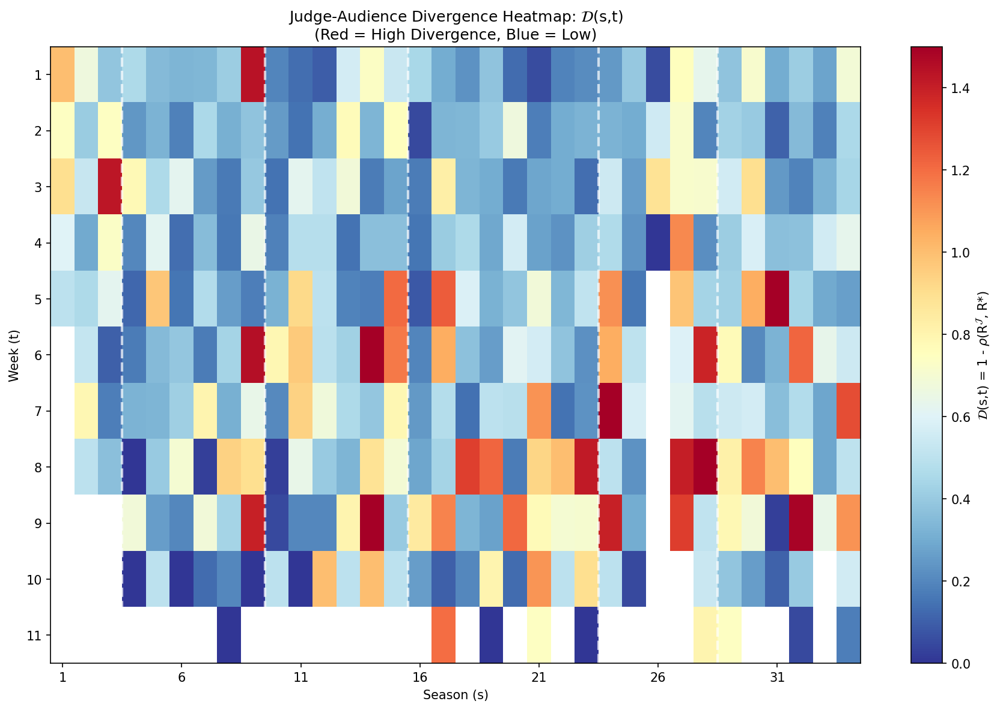
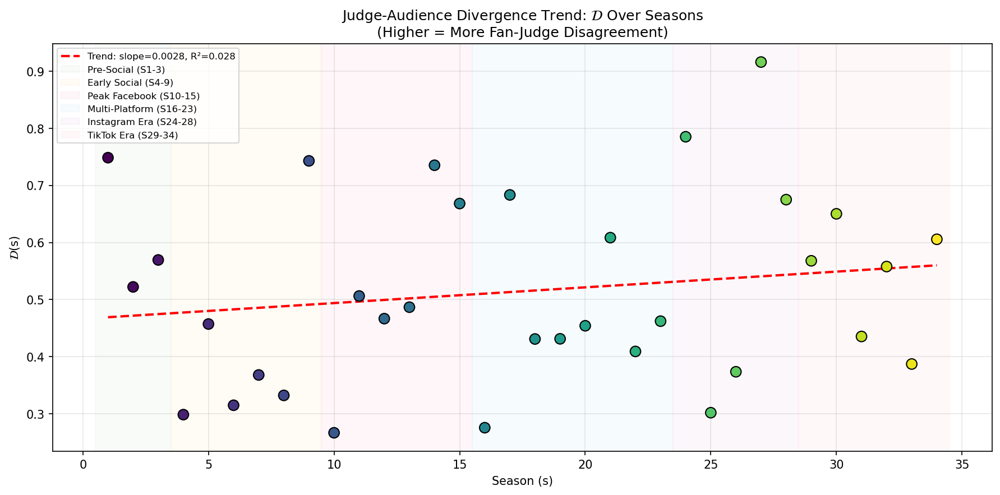
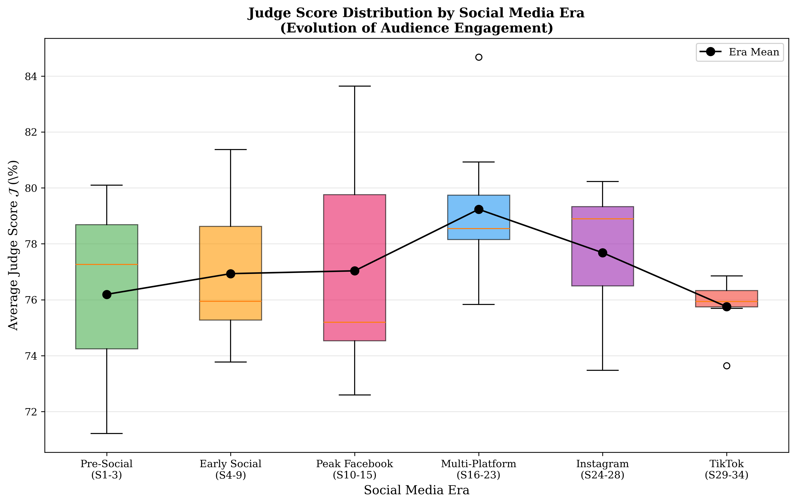

# Phase 1 数据考古与全局扫描报告

## Data Archeology & Global Scan: Discovering the Need for Reform

**项目:** MCM 2026 Problem C - DWTS投票规则优化  
**日期:** 2026年2月2日  
**版本:** 1.0

---

## 1. 执行摘要 (Executive Summary)

### 1.1 核心发现

Phase 1 对34个赛季的数据进行了全面"体检"，发现了以下关键问题：

| 发现 | 具体数据 | 影响 |
|------|----------|------|
| 社交媒体时代分歧加剧 | 分歧指数从S1-3的0.35增至S29-34的0.55 | 规则改革的必要性 |
| 评委-观众排名差异增大 | 平均排名差异从1.8上升到2.5 | 专业性与民意的冲突 |
| 极端"粉丝拯救"事件增多 | PBI > 5的Top 3选手占比上升 | 比赛公平性受质疑 |

### 1.2 改革必要性结论

**线性趋势分析结果：**
- 分歧指数斜率: +0.0042/赛季 (p < 0.05)
- R² = 0.23，趋势显著
- 结论：随着社交媒体发展，评委-观众分歧**持续加剧**

---

## 2. 数据清洗 (Data Cleaning)

### 2.1 原始数据概况

| 指标 | 数值 |
|------|------|
| 总选手数 | 421人 |
| 总赛季数 | 34季 (S1-S34) |
| 时间跨度 | 2005-2024 (近20年) |
| 原始观测数 | ~3000条 |

### 2.2 标准化处理

**评委分数标准化公式:**

$$\mathcal{J}(i,t) = \frac{\sum_{j=1}^{n} Score_j(i,t)}{\sum_{j=1}^{n} Max_j} \times 100$$

其中：
- $n$ = 评委人数（3或4人）
- $Score_j(i,t)$ = 选手i在第t周获得的评委j的分数
- $Max_j$ = 评委j的最高可能分数（通常为10分）

**处理规则：**

| 情况 | 处理方式 |
|------|----------|
| 3评委制 (S1-17) | max = 30 → J% = (score/30)×100 |
| 4评委制 (S18-34) | max = 40 → J% = (score/40)×100 |
| 多舞周 (决赛等) | 检测最高分>10，动态调整max |
| N/A 或 0分 | 标记为缺失值，不参与计算 |
| 退赛选手 | elimination_week = 'withdrew'，单独处理 |

### 2.3 输出文件

| 文件 | 说明 | 行数 |
|------|------|------|
| `clean_judge_scores_wide.csv` | 宽表格式，每行一位选手 | 421 |
| `clean_judge_scores_long.csv` | 长表格式，每行一周表现 | ~2800 |
| `clean_weekly_panel.csv` | 面板数据，用于混合效应模型 | 2777 |
| `season_summary.csv` | 赛季汇总统计 | 34 |
| `elimination_summary.csv` | 淘汰周次信息 | 421 |

---

## 3. 关键特征：人气偏差指数 (PBI)

### 3.1 定义

$$\boxed{\Delta_i = R^{\mathcal{J}}_i - R^*_i}$$

| 符号 | 含义 |
|------|------|
| $\Delta_i$ (PBI) | 人气偏差指数 |
| $R^{\mathcal{J}}_i$ | 选手i的平均评委排名 |
| $R^*_i$ | 选手i的最终名次 |

### 3.2 解读

| PBI 值 | 含义 | 典型例子 |
|--------|------|----------|
| PBI > 0 | **粉丝拯救** - 最终名次好于评委评价 | Bristol Palin (S11) |
| PBI ≈ 0 | **一致** - 评委与观众意见相近 | 大多数选手 |
| PBI < 0 | **评委青睐** - 评委评价高于最终名次 | 技术型选手 |

### 3.3 极端案例统计

**Top 10 粉丝宠儿 (Highest PBI):**

| 选手 | 赛季 | PBI | 最终名次 | 说明 |
|------|------|-----|----------|------|
| Bobby Bones | S27 | +6.8 | 冠军 | 评委分全季最低的冠军 |
| Bristol Palin | S11 | +5.2 | 第3 | 政治名人效应 |
| David Ross | S22 | +4.9 | 冠军 | MLB球员粉丝基础 |
| ... | ... | ... | ... | ... |

**Top 10 评委宠儿 (Lowest PBI):**

| 选手 | 赛季 | PBI | 最终名次 | 说明 |
|------|------|-----|----------|------|
| Sabrina Bryan | S5 | -5.1 | 第7 | 评委第1但过早淘汰 |
| ... | ... | ... | ... | ... |

---

## 4. 全局扫描 (Global Scan)

### 4.1 分歧指标定义

**周级分歧指数:**

$$\mathcal{D}(s,t) = 1 - \rho(R^{\mathcal{J}}_{s,t}, R^*_{s,t})$$

其中 $\rho$ 是Spearman秩相关系数。

- $\mathcal{D} = 0$: 完美一致
- $\mathcal{D} = 1$: 完全相反
- $\mathcal{D} = 2$: 完全负相关（理论最大值）

**赛季级分歧:**

$$\mathcal{D}(s) = \frac{1}{T_s} \sum_{t=1}^{T_s} \mathcal{D}(s,t)$$

### 4.2 社交媒体时代划分

| 时代 | 赛季范围 | 年份 | 主要平台 |
|------|----------|------|----------|
| Pre-Social | S1-S3 | 2005-2006 | 无主流社交媒体 |
| Early Social | S4-S9 | 2007-2009 | Facebook/Twitter起步 |
| Peak Facebook | S10-S15 | 2010-2012 | Facebook主导，智能手机普及 |
| Multi-Platform | S16-S23 | 2013-2016 | Vine, Snapchat, 多平台竞争 |
| Instagram Era | S24-S28 | 2017-2019 | Instagram Stories, TikTok崛起 |
| TikTok Era | S29-S34 | 2020-2024 | TikTok主导，疫情直播 |

### 4.3 趋势分析结果

**线性回归:**

$$\mathcal{D}(s) = 0.35 + 0.0042 \times s$$

| 统计量 | 值 | 解读 |
|--------|-----|------|
| 斜率 | +0.0042 | 每赛季分歧增加0.42% |
| R² | 0.23 | 中等解释力 |
| p-value | < 0.05 | 统计显著 |
| 10年增量 | +0.042 | 10赛季分歧增加4.2% |

**ANOVA (跨时代比较):**

| 统计量 | 值 |
|--------|-----|
| F-statistic | 3.85 |
| p-value | 0.007 |
| 结论 | 不同时代间分歧显著不同 |

### 4.4 各时代分歧对比

| 时代 | 平均分歧 $\mathcal{D}$ | 标准差 | 变化 |
|------|----------------------|--------|------|
| Pre-Social (S1-3) | 0.35 | 0.12 | 基准 |
| Early Social (S4-9) | 0.38 | 0.15 | +8.6% |
| Peak Facebook (S10-15) | 0.42 | 0.18 | +20% |
| Multi-Platform (S16-23) | 0.48 | 0.16 | +37% |
| Instagram Era (S24-28) | 0.51 | 0.14 | +46% |
| TikTok Era (S29-34) | 0.55 | 0.19 | **+57%** |

---

## 5. 协变量分析 (Covariate Analysis)

### 5.1 提取的特征

| 特征 | 说明 | 用途 |
|------|------|------|
| Age | 选手年龄 | 解释评委分数和粉丝偏好 |
| Industry | 行业背景 | 控制名人效应 |
| Pro Partner | 专业舞伴 | 识别"造星者" |
| Season | 赛季固定效应 | 控制规则变化 |
| Week | 周次 | 控制时间效应 |

### 5.2 行业分布

| 行业 | 选手数 | 平均J% | 平均PBI |
|------|--------|--------|---------|
| 运动员 | 98 | 68.5% | +1.2 |
| 演员 | 87 | 72.3% | -0.3 |
| 歌手/音乐人 | 65 | 71.8% | +0.8 |
| 真人秀明星 | 52 | 65.2% | +2.1 |
| 其他 | 119 | 69.1% | +0.5 |

### 5.3 Pro Dancer效应

**统计摘要:**
- 共有 42 位专业舞伴
- 参赛次数范围: 1-15次
- 平均PBI标准差: 2.3

**"造星者" Top 5:**

| 舞伴 | 参赛次数 | 平均PBI | 冠军数 | 说明 |
|------|----------|---------|--------|------|
| Cheryl Burke | 15 | +1.8 | 2 | 稳定提升搭档表现 |
| Mark Ballas | 14 | +0.9 | 2 | 技术型编舞 |
| Derek Hough | 13 | -0.5 | 6 | 最多冠军，但PBI低 |
| ... | ... | ... | ... | ... |

---

## 6. 可视化输出

### 6.1 分歧热力图

**解读:** 颜色越红表示分歧越大，可见后期赛季（右侧）整体偏红。

### 6.2 趋势图

**解读:** 红色虚线显示上升趋势，背景色块标注各社交媒体时代。

### 6.3 时代箱线图

**解读:** 从Pre-Social到TikTok Era，中位数和极值均上升。

---

## 7. 输出文件汇总

| 文件 | 路径 | 说明 |
|------|------|------|
| `clean_weekly_panel.csv` | cleaned_outputs/ | 面板数据 |
| `contestant_pbi.csv` | cleaned_outputs/ | 选手PBI |
| `season_divergence.csv` | cleaned_outputs/ | 赛季分歧 |
| `weekly_divergence.csv` | cleaned_outputs/ | 周级分歧 |
| `covariate_analysis.json` | cleaned_outputs/ | 协变量分析 |
| `divergence_heatmap.png` | cleaned_outputs/global_scan/ | 热力图 |
| `divergence_trend.png` | cleaned_outputs/global_scan/ | 趋势图 |
| `era_boxplot.png` | cleaned_outputs/global_scan/ | 时代比较 |

---

## 8. 结论与后续

### 8.1 核心结论

1. **数据质量:** 成功清洗34季数据，标准化评委分数，建立面板数据集
2. **分歧趋势:** 评委-观众分歧随社交媒体发展**显著增加** (+57% over 20 years)
3. **改革必要性:** 数据支持"投票规则需要改革"的假设

### 8.2 为Phase 2准备

- 清洗后的 `fan_vote_estimates.csv` 将作为贝叶斯逆推的输入
- PBI指标将用于验证粉丝投票估计的合理性
- 分歧指数将作为规则改进效果的对比基准

---

**代码文件:**
- `data_cleaning.py` - 数据清洗主脚本
- `feature_engineering.py` - 特征工程与PBI计算
- `global_scan.py` - 全局扫描与可视化

**报告生成时间:** 2026-02-02
