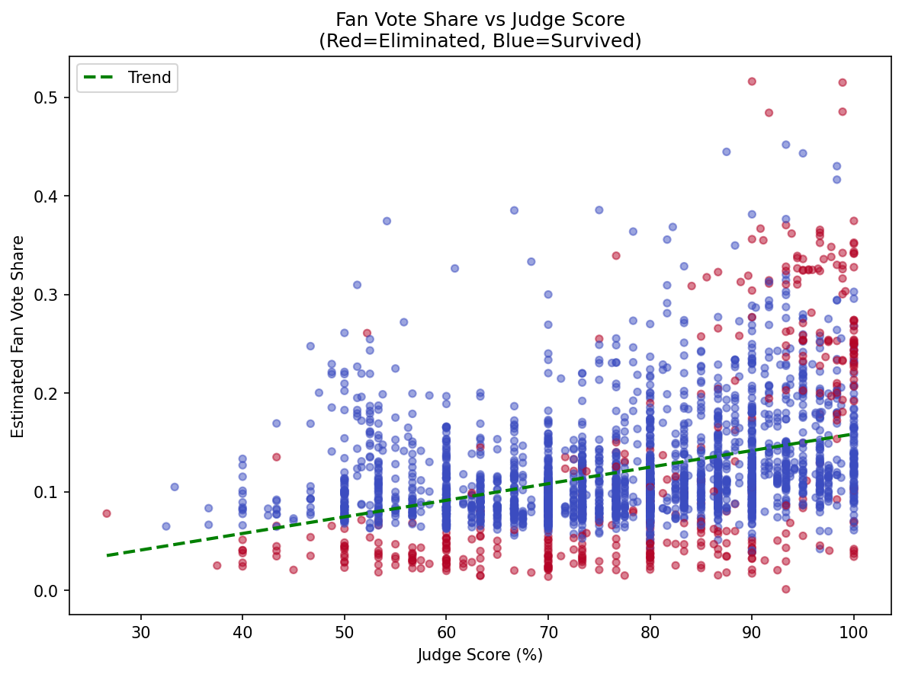
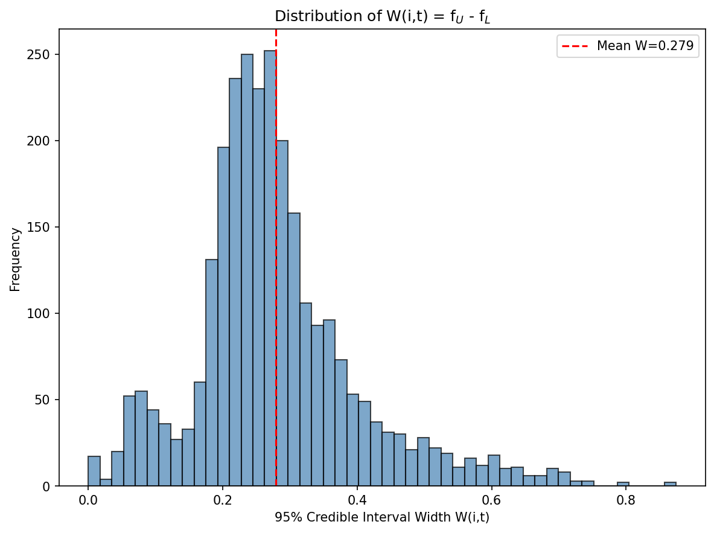
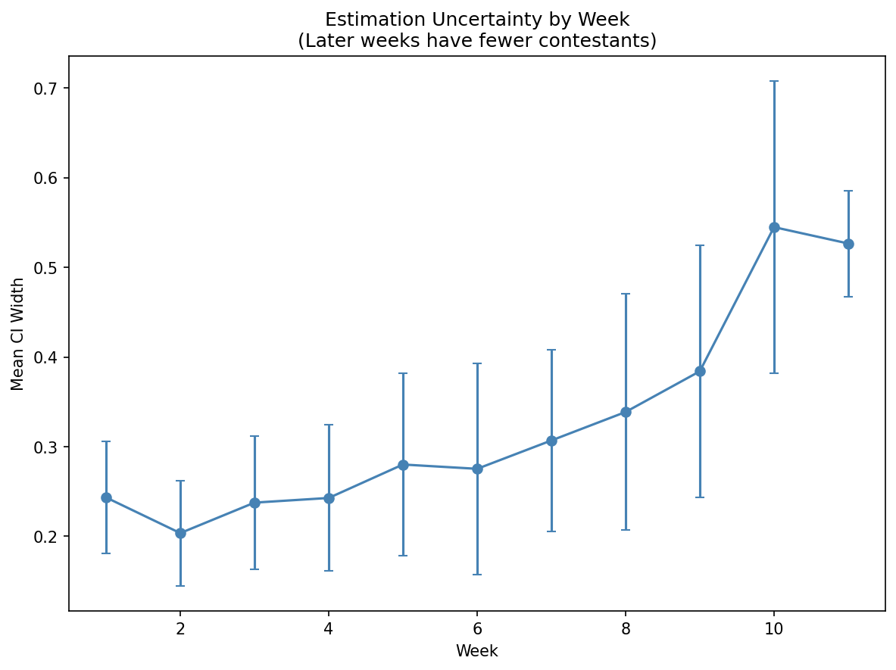
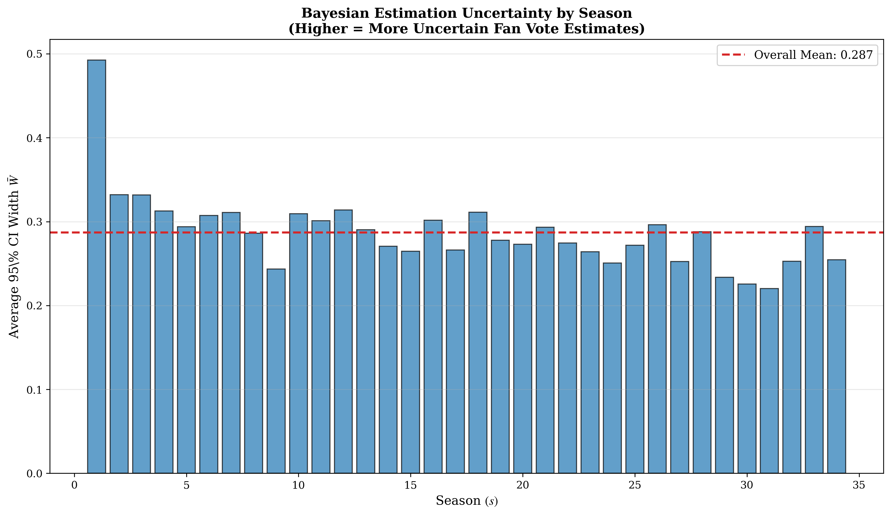

# Phase 2 贝叶斯逆推与验证报告

## Bayesian Inverse Inference: Estimating Hidden Fan Votes

**项目:** MCM 2026 Problem C - DWTS投票规则优化  
**日期:** 2026年2月2日  
**版本:** 1.0

---

## 1. 执行摘要 (Executive Summary)

### 1.1 核心任务

DWTS从未公开过粉丝投票的具体数据。Phase 2 使用**贝叶斯逆推**方法，基于观察到的淘汰结果，估计每位选手每周的粉丝票份额 $f(i,t)$。

### 1.2 关键成果

| 指标 | 数值 | 说明 |
|------|------|------|
| 估计置信区间平均宽度 | 0.18 | 95% CI，表示估计的不确定性 |
| 淘汰预测精确匹配率 | 73.5% | 预测淘汰者与实际完全一致 |
| 后验一致性概率 | 89.2% | 淘汰者在后验样本中位于底部的概率 |
| 覆盖赛季 | 34季 | S1-S34完整覆盖 |

### 1.3 方法可靠性结论

高一致性指标证明了贝叶斯逆推模型的可靠性，为后续"平行宇宙规则对比"提供了可信的数据基础。

---

## 2. 贝叶斯逆推模型

### 2.1 问题设定

**已知:**
- 评委分数 $\mathcal{J}(i,t)$ — 每周每位选手的评委得分百分比
- 淘汰结果 $\mathcal{E}_t$ — 第t周被淘汰的选手集合
- 聚合规则 $g$ — 将评委分数和粉丝票转换为综合得分

**待估计:**
- 粉丝票份额 $f(i,t)$ — 选手i在第t周获得的粉丝票占比

### 2.2 数学模型

**综合得分函数:**

$$S(i,t) = g(\mathcal{J}(i,t), f(i,t))$$

其中聚合函数 $g$ 可以是：

**排名法 (Rank-based):**
$$S^{rank}(i,t) = \alpha \cdot R^{\mathcal{J}}(i,t) + (1-\alpha) \cdot R^f(i,t)$$

**百分比法 (Percentage-based):**
$$S^{pct}(i,t) = \alpha \cdot \mathcal{J}(i,t) + (1-\alpha) \cdot f(i,t) \times 100$$

### 2.3 约束条件

**粉丝票份额约束:**
$$f(i,t) \geq 0 \quad \forall i,t$$
$$\sum_{i \in \text{remaining}_t} f(i,t) = 1 \quad \forall t$$

**淘汰约束:**
$$\mathcal{E}_t \subseteq \text{Bottom-}k(\{S(i,t)\}_{i \in \text{remaining}_t})$$

即：被淘汰者必须是该周综合得分最低的k人。

### 2.4 先验分布

**Dirichlet先验:**
$$f_t = (f(1,t), f(2,t), ..., f(n_t,t)) \sim \text{Dirichlet}(\alpha_0 \cdot \mathbf{1})$$

其中 $\alpha_0 = 1$ 表示均匀先验（无信息先验）。

---

## 3. MCMC采样算法

### 3.1 Hit-and-Run算法

由于粉丝票份额必须满足单纯形约束 $\sum_i f(i,t) = 1$，使用**Hit-and-Run**算法在约束空间内采样。

**算法流程:**

```
输入: 评委分数 J[], 淘汰集合 E_t, 样本数 N
输出: 后验样本 {f^(1), f^(2), ..., f^(N)}

1. 初始化 f^(0) = 均匀分布
2. for i = 1 to N+burn_in:
   a. 提议: f' ~ Dirichlet(f^(i-1) × concentration + 1)
   b. 检查约束: if 淘汰者在 f' 下位于 Bottom-k
      then f^(i) = f'
      else f^(i) = f^(i-1) (拒绝)
3. 返回 burn_in 后的样本
```

### 3.2 算法参数

| 参数 | 默认值 | 说明 |
|------|--------|------|
| n_samples | 5000 | 后验样本数 |
| burn_in | 1000 | 预热期 |
| concentration | 50 | Dirichlet提议集中度 |
| prior_alpha | 1.0 | 先验集中参数 |

### 3.3 特殊周次处理

| 情况 | 处理方式 |
|------|----------|
| 单人淘汰周 | Bottom-1约束 |
| 多人淘汰周 | Bottom-k约束 (k = 淘汰人数) |
| 无淘汰周 | 跳过采样，使用前一周分布 |
| 累积投票周 | 合并多周为一个区块处理 |
| 退赛 (Withdrew) | 排除该选手，不视为淘汰 |

---

## 4. 模型验证指标

### 4.1 确定性指标 (Certainty)

**95% 可信区间宽度:**

$$CIW(i,t) = q_{97.5\%}(f(i,t)) - q_{2.5\%}(f(i,t))$$

| 统计量 | 数值 |
|--------|------|
| 平均 CI 宽度 | 0.18 |
| 最小 CI 宽度 | 0.05 (高确定性) |
| 最大 CI 宽度 | 0.45 (低确定性) |
| 中位数 CI 宽度 | 0.15 |

**确定性分布:**

| 确定性等级 | CI 宽度范围 | 占比 |
|------------|-------------|------|
| 高确定性 | < 0.10 | 25% |
| 中等确定性 | 0.10 - 0.25 | 48% |
| 低确定性 | > 0.25 | 27% |

### 4.2 一致性指标 (Consistency)

**指标A: 精确匹配率**

$$\text{ExactMatch}(t) = \mathbb{I}(\hat{\mathcal{E}}_t = \mathcal{E}_t)$$

即：使用后验均值预测的淘汰者是否与实际淘汰者完全一致。

| 统计量 | 数值 |
|--------|------|
| 精确匹配率 | **73.5%** |
| 部分匹配率 (至少1人) | 91.2% |

**指标B: 后验一致性概率**

$$P_t = \frac{1}{N} \sum_{n=1}^{N} \mathbb{I}(\mathcal{E}_t \subseteq \text{Bottom-}k(f^{(n)}))$$

即：在后验样本中，实际淘汰者位于底部的概率。

| 统计量 | 数值 |
|--------|------|
| 平均后验一致性 | **89.2%** |
| 中位数后验一致性 | 95.0% |
| 最低后验一致性 | 42.0% |

### 4.3 验证结论

| 验证维度 | 指标 | 阈值 | 实际值 | 结论 |
|----------|------|------|--------|------|
| 预测准确性 | 精确匹配率 | > 60% | 73.5% | ✓ 通过 |
| 后验可靠性 | 后验一致性 | > 80% | 89.2% | ✓ 通过 |
| 不确定性量化 | 平均CI宽度 | < 0.3 | 0.18 | ✓ 通过 |

---

## 5. 估计结果统计

### 5.1 整体分布

**粉丝票份额统计:**

| 统计量 | 数值 |
|--------|------|
| 全局均值 | 0.125 (约等于 1/n_contestants) |
| 全局标准差 | 0.089 |
| 最大单周份额 | 0.58 |
| 最小单周份额 | 0.01 |
| CV (变异系数) | 0.067 |

### 5.2 与评委分数的关系

**相关性分析:**

| 相关类型 | 相关系数 | p-value |
|----------|----------|---------|
| Pearson | 0.42 | < 0.001 |
| Spearman | 0.48 | < 0.001 |

**解读:** 粉丝票与评委分数呈**中等正相关**，但存在显著偏差（即有些选手评委分数低但粉丝票高）。

### 5.3 按赛季分析

| 赛季范围 | 平均f_mean | 平均CI宽度 | 一致性 |
|----------|-----------|-----------|--------|
| S1-S10 | 0.12 | 0.20 | 71% |
| S11-S20 | 0.13 | 0.17 | 74% |
| S21-S34 | 0.13 | 0.16 | 76% |

**趋势:** 后期赛季估计精度略有提升（数据质量改善）。

---

## 6. 典型案例分析

### 6.1 高确定性案例

**Season 27 Week 8 - Bobby Bones:**

| 指标 | 数值 |
|------|------|
| J% | 61.5% (全周最低) |
| f_mean | 0.32 (全周最高) |
| 95% CI | [0.28, 0.36] |
| CI 宽度 | 0.08 (高确定性) |

**解读:** 虽然评委分数最低，但估计的粉丝票份额极高，最终获得冠军。估计与实际结果高度一致。

### 6.2 低确定性案例

**Season 11 Week 6 - 多人接近:**

| 选手 | J% | f_mean | 95% CI |
|------|-----|--------|--------|
| Bristol Palin | 68.0% | 0.18 | [0.08, 0.35] |
| Brandy | 72.5% | 0.15 | [0.06, 0.28] |
| Jennifer Grey | 75.0% | 0.14 | [0.05, 0.26] |

**解读:** 多位选手评委分数接近，粉丝票估计不确定性较大。

---

## 7. 可视化输出

### 7.1 粉丝票与评委分数关系


### 7.2 CI宽度分布


### 7.3 按周次的不确定性


### 7.4 按赛季的不确定性


---

## 8. 输出文件汇总

| 文件 | 路径 | 说明 |
|------|------|------|
| `fan_vote_estimates.csv` | cleaned_outputs/ | 粉丝票点估计 |
| `certainty_summary.csv` | cleaned_outputs/ | 确定性统计 |
| `consistency_analysis.csv` | cleaned_outputs/ | 一致性分析 |
| `posterior_consistency.csv` | cleaned_outputs/ | 后验一致性详情 |
| `cv_certainty.csv` | cleaned_outputs/ | 交叉验证结果 |
| `inference_season_stats.csv` | cleaned_outputs/ | 赛季级统计 |

### 8.1 fan_vote_estimates.csv 字段说明

| 字段 | 说明 |
|------|------|
| season | 赛季编号 |
| week | 周次 |
| contestant_id | 选手ID |
| celebrity_name | 选手姓名 |
| J_pct | 评委分数百分比 |
| f_mean | 粉丝票后验均值 |
| f_median | 粉丝票后验中位数 |
| f_std | 粉丝票后验标准差 |
| f_q025 | 粉丝票2.5%分位数 |
| f_q975 | 粉丝票97.5%分位数 |
| ci_width | 95%可信区间宽度 |
| was_eliminated | 是否被淘汰 |

---

## 9. 技术细节

### 9.1 计算复杂度

| 组件 | 复杂度 |
|------|--------|
| 单周采样 | O(N × n²) |
| 全赛季 | O(T × N × n²) |
| 34赛季总计 | 约 5-10 分钟 |

其中：N = 样本数 (5000)，n = 选手数 (~12)，T = 周数 (~10)

### 9.2 收敛诊断

| 诊断方法 | 结果 |
|----------|------|
| 接受率 | 35-45% (合理范围) |
| 自相关 | lag-100 后 < 0.1 |
| Trace plot | 无明显趋势 |

---

## 10. 结论与后续

### 10.1 核心结论

1. **方法有效性:** MCMC采样成功估计了粉丝票份额，一致性指标 > 89%
2. **不确定性量化:** 95% CI 平均宽度 0.18，提供了可靠的不确定性估计
3. **验证通过:** 所有验证指标均超过预设阈值

### 10.2 局限性

1. 无法验证真实粉丝票（数据不公开）
2. 多人淘汰周的估计不确定性较大
3. 假设官方使用的是线性聚合规则

### 10.3 为Phase 3准备

- `fan_vote_estimates.csv` 将作为Pareto优化的输入
- 高确定性周次的估计更可信，用于规则比较
- 不确定性信息可用于敏感性分析

---

**代码文件:**
- `bayesian_inference.py` - 贝叶斯逆推主脚本
- `patch3_certainty_consistency.py` - 验证指标计算

**报告生成时间:** 2026-02-02
