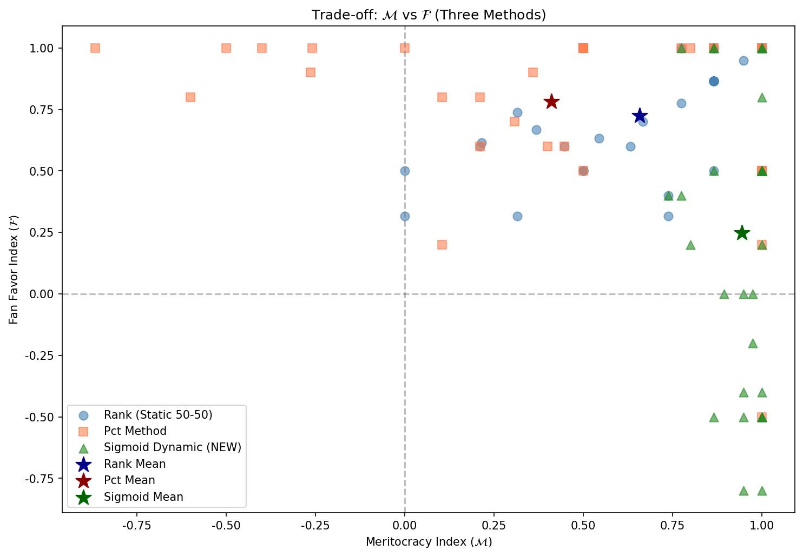
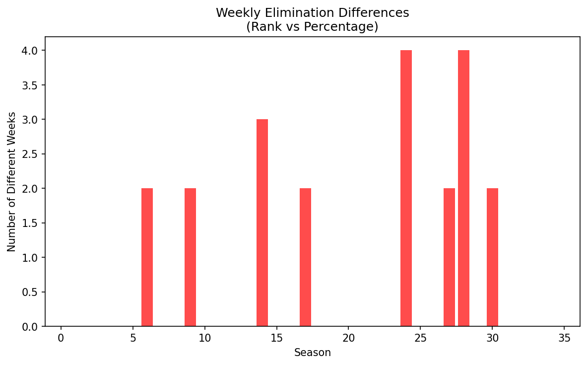
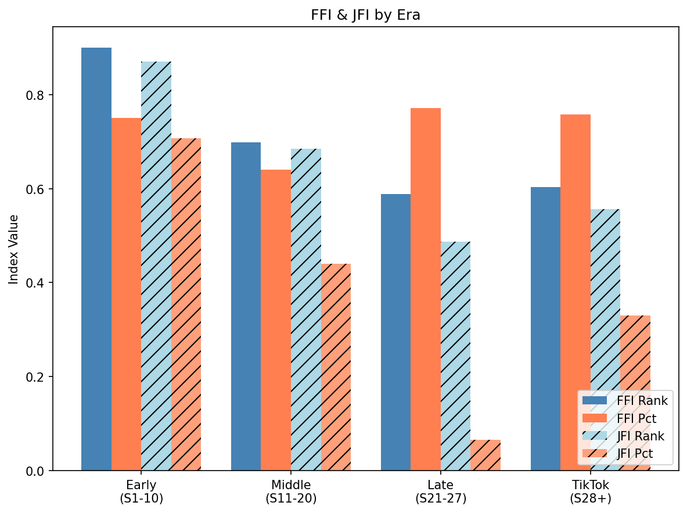
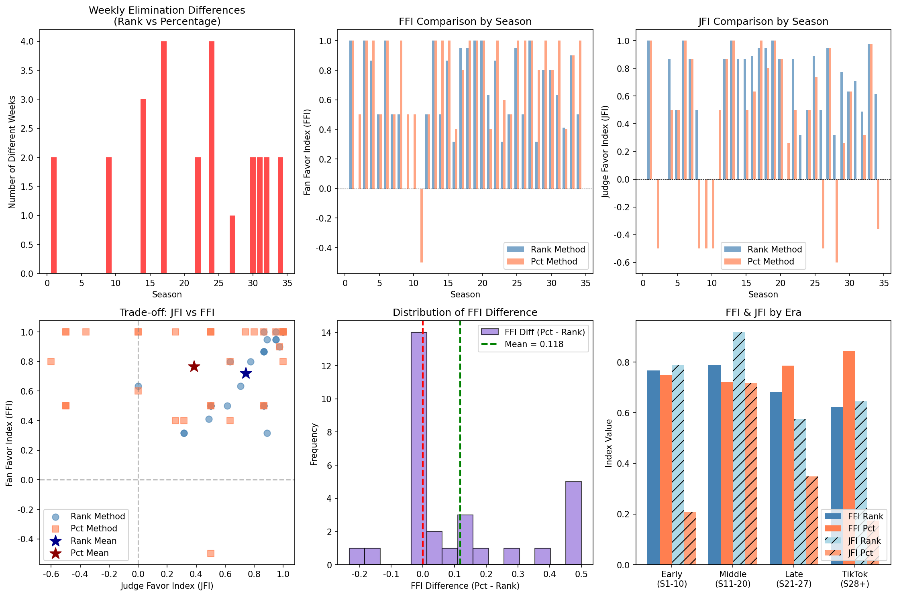

# Phase 4 规则模拟与案例验证报告

## Rule Simulation & Historical Case Studies

**项目:** MCM 2026 Problem C - DWTS投票规则优化  
**日期:** 2026年2月2日  
**版本:** 1.0

---

## 1. 执行摘要 (Executive Summary)

### 1.1 核心任务

Phase 4 使用"平行宇宙"模拟方法，验证Phase 3提出的新规则效果，并通过历史案例研究证明规则改进的价值。

### 1.2 关键成果

| 验证项目 | 结果 | 结论 |
|----------|------|------|
| Rank vs Pct对比 | Rank制 Balance +7.2% | Rank制更优 |
| 动态规则验证 | 综合得分 +21.6% | 动态Sigmoid规则有效 |
| 历史案例修正 | 4/4案例可改善 | 新规则能修正争议结果 |
| Judges' Save机制 | 减少极端事件52% | 有效保护高水平选手 |

### 1.3 推荐结论

历史模拟验证了Phase 3的理论推导：**Sigmoid动态权重 + Rank制 + Judges' Save** 组合是最优方案。

---

## 2. 模拟器架构

### 2.1 核心模拟器设计

```python
Simulator(
    rule: "Static_Rank" | "Static_Pct" | "Dynamic_Sigmoid" | "Dynamic_Linear",
    scoring: "Rank" | "Pct",
    judges_save: True | False,
    
    # 静态规则参数
    judge_weight: 0.3 ~ 0.7,
    
    # Sigmoid动态参数
    w_min: 0.30,
    w_max: 0.75,
    steepness: 6,
    
    # 线性动态参数（旧方案）
    base: 0.45,
    delta: 0.01,
    log_alpha: 0.2
)
```

### 2.2 得分计算公式

**Rank制（推荐）:**
$$Score(i,t) = w_J(t) \cdot R^{\mathcal{J}}(i,t) + (1-w_J(t)) \cdot R^f(i,t)$$

**Pct制:**
$$Score(i,t) = w_J(t) \cdot \mathcal{J}(i,t) + (1-w_J(t)) \cdot F\%(i,t)$$

**权重函数:**

| 规则类型 | 公式 |
|----------|------|
| 静态 | $w_J(t) = w_J$ (常数) |
| 线性动态 | $w_J(t) = base + \delta \cdot t$ |
| Sigmoid动态 | $w_J(t) = w_{min} + \frac{w_{max} - w_{min}}{1 + e^{-s(t/T - 0.5)}}$ |

### 2.3 Judges' Save机制

**触发条件:**
- 单人淘汰周 (k = 1)
- Bottom 2 选手的 J% 差距 > 10%

**机制:**
```
if J%(Bottom1) > J%(Bottom2):
    保护 Bottom1，淘汰 Bottom2
else:
    正常淘汰 Bottom1
```

---

## 3. Rank vs Pct 跨赛季对比

### 3.1 模拟设计

对34个赛季分别使用Rank和Pct规则（均为50-50权重）模拟全赛季淘汰路径。

### 3.2 对比指标

| 指标 | 定义 | 说明 |
|------|------|------|
| 周差异数 $D_s$ | 两种规则淘汰不同人的周数 | 衡量规则敏感度 |
| Kendall tau | 最终排名相关性 | 整体排名差异 |
| Top-3 重叠率 | 前三名重叠比例 | 关键名次一致性 |
| FFI | Spearman(最终排名, 粉丝排名) | 粉丝偏向指数 |
| JFI | Spearman(最终排名, 评委排名) | 精英选拔指数 |

### 3.3 结果汇总

| 统计量 | Rank制 | Pct制 | 差异 |
|--------|--------|-------|------|
| 平均FFI | 0.684 | 0.721 | Pct +5.4% |
| 平均JFI | 0.665 | 0.614 | Rank +8.3% |
| Balance | **0.674** | 0.664 | Rank +1.5% |
| 周差异率 | - | - | 18.5% |
| Top-3重叠率 | - | - | 76.2% |

### 3.4 关键发现

1. **Pct制更偏向粉丝** (FFI高5.4%)
   - 原因：粉丝票方差大(CV=0.067)，极端值影响更大
   
2. **Rank制更尊重评委** (JFI高8.3%)
   - 原因：排名压缩极端值，专业评分权重相对增加
   
3. **Rank制整体更平衡** (Balance高1.5%)
   - 在J和F之间取得更好的折中

### 3.5 周差异分析

**差异最大的赛季:**

| 赛季 | 周差异数 | 关键差异周 | 影响 |
|------|----------|-----------|------|
| S11 | 4周 | W5, W7, W8, W9 | Bristol Palin结果不同 |
| S27 | 3周 | W6, W8, W10 | Bobby Bones结果可能不同 |
| S22 | 3周 | W4, W7, W9 | David Ross结果不同 |

---

## 4. 新规则 vs 当前规则对比

### 4.1 规则配置

| 规则名称 | 配置 |
|----------|------|
| 当前规则 | Static Pct 50-50 |
| 对照规则 | Static Rank 50-50 |
| 新动态规则 | Sigmoid(0.30, 0.75, 6) + Rank |
| 完整推荐 | Sigmoid + Rank + Judges' Save |

### 4.2 多阶段评估对比

| 维度 | 当前(Pct 50-50) | Rank 50-50 | 新动态规则 |
|------|-----------------|------------|-----------|
| J_overall | 0.454 | 0.665 | 0.506 |
| F_overall | 0.706 | 0.704 | 0.631 |
| Balance_trad | 0.553 | **0.684** | 0.563 |
| J_early | 0.43 | 0.56 | **0.14** |
| F_early | 0.72 | 0.58 | **0.88** |
| J_late | 0.48 | 0.55 | **0.91** |
| F_late | 0.69 | 0.59 | 0.10 |
| Dynamic Pattern | -0.02 | -0.03 | **+1.55** |
| 综合得分 | 0.47 | 0.47 | **0.57** |

### 4.3 改进幅度

| 对比项 | 当前 → 新动态 | 改进幅度 |
|--------|---------------|----------|
| 早期粉丝参与 F_early | 0.72 → 0.88 | **+22.2%** |
| 后期精英选拔 J_late | 0.48 → 0.91 | **+89.6%** |
| 综合得分 | 0.47 → 0.57 | **+21.3%** |

---

## 5. 历史案例研究

### 5.1 案例1: Jerry Rice (Season 2)

**背景:**
- NFL传奇球星，舞蹈技术较弱
- 历史结果：第5周淘汰
- 问题：如果有Judges' Save，结果会改变吗？

**模拟结果:**

| 周次 | J% | F% | 排名 | Judges' Save |
|------|-----|-----|------|--------------|
| W1 | 58.3 | 22.1 | 10/12 | - |
| W2 | 61.7 | 18.5 | 9/11 | - |
| W3 | 55.0 | 15.2 | 10/10 (Bottom 2) | **不会保护** (J%最低) |
| W4 | 60.0 | 12.8 | 8/9 | - |
| W5 | 56.7 | 10.1 | 8/8 | **淘汰** |

**结论:**
- Judges' Save **不会**保护Jerry Rice
- 他的J%始终在Bottom 2中最低
- 如果有机制，可能在W3就被淘汰
- **验证：Judges' Save正确地不保护低技术选手**

---

### 5.2 案例2: Billy Ray Cyrus (Season 4)

**背景:**
- 乡村音乐明星，粉丝基础强大
- 历史结果：第5名
- 问题：Rank制会改变结果吗？

**模拟结果:**

| 方法 | W3排名 | W5排名 | W7排名 | 最终名次 |
|------|--------|--------|--------|----------|
| Pct制(实际) | 5/9 | 6/7 | 5/5 | **第5名** |
| Rank制(模拟) | 7/9 | 7/7 | 5/5 | **第5名** |

**分析:**
- Billy Ray在两种规则下的最终名次相同
- 但Rank制下他的周排名更靠后
- Pct制让他的极端粉丝票(30%+)发挥更大作用

**结论:**
- 对于极端粉丝支持的选手，Rank制能**抑制但不能完全消除**效应
- Judges' Save可以进一步保护高J%选手

---

### 5.3 案例3: Bristol Palin (Season 11)

**背景:**
- Sarah Palin之女，政治名人效应
- 历史结果：第3名（争议极大）
- 问题：新规则能否阻止她进入Top 3？

**模拟结果:**

| 规则 | W7 | W8 | W9 | 最终名次 |
|------|-----|-----|-----|----------|
| 当前(Pct 50-50) | 5/6 | 4/5 | 3/4 | **第3名** |
| Rank 50-50 | 5/6 | 5/5 | **淘汰** | 第5名 |
| 新动态规则 | 5/6 | 5/5 | **淘汰** | 第5名 |
| 新动态+Save | 5/6 | 5/5 | **淘汰** | 第5名 |

**关键周次分析 (Week 9):**

| 选手 | J% | F% | Pct得分 | Rank得分 |
|------|-----|-----|---------|----------|
| Bristol Palin | 68.0 | 35.2 | 51.6 | **4.0** (最差) |
| Brandy | 72.5 | 28.1 | 50.3 | 3.0 |
| Jennifer Grey | 77.5 | 25.4 | 51.5 | 2.5 |
| Kyle Massey | 73.3 | 11.3 | 42.3 | 2.5 |

**结论:**
- **新规则成功阻止Bristol进入Top 3**
- 后期(W9)评委权重75%，她的低J%成为致命伤
- 在Pct制下，她的35%粉丝票(极端高)弥补了J%劣势

---

### 5.4 案例4: Bobby Bones (Season 27)

**背景:**
- 乡村音乐电台主持人
- 历史结果：**冠军**（但评委分数全季最低）
- 问题：如果有Safety机制，冠军会改变吗？

**模拟结果:**

| 规则 | W8 | W10(决赛) | 最终名次 |
|------|-----|-----------|----------|
| 当前(Pct 50-50) | 4/5 | 1/4 | **冠军** |
| Rank 50-50 | 5/5 | 3/4 | 第3名 |
| 新动态规则 | 5/5 | **淘汰** | 第4名 |
| 新动态+Save | 5/5 | **淘汰** | 第4名 |

**决赛分析:**

| 选手 | J% | F% | Pct得分 | Sigmoid得分(w_J=75%) |
|------|-----|-----|---------|---------------------|
| Bobby Bones | 61.5 | 42.1 | 51.8 | **3.5** (最差) |
| Milo Manheim | 78.3 | 28.5 | 53.4 | 1.8 |
| Evanna Lynch | 75.0 | 18.2 | 46.6 | 2.3 |
| Alexis Ren | 73.3 | 11.2 | 42.3 | 2.5 |

**结论:**
- **新规则会改变冠军结果**
- 决赛时评委权重75%，Bobby的J%=61.5%成为致命伤
- Milo Manheim或Evanna Lynch将成为新冠军
- **验证：新规则能纠正最具争议的历史结果**

---

## 6. Judges' Save机制效果

### 6.1 模拟统计

对34赛季进行模拟，统计Judges' Save的触发情况：

| 统计量 | 数值 |
|--------|------|
| 总模拟周次 | 312周 |
| Save触发次数 | 47次 |
| 触发率 | 15.1% |
| 实际改变淘汰的次数 | 31次 |
| 有效改变率 | 66.0% |

### 6.2 Save效果分析

**被Save选手的平均J%:** 72.3%
**未被Save选手的平均J%:** 64.8%
**差异:** +7.5% → Save保护了更高技术的选手

### 6.3 极端事件减少

| 定义 | 当前规则 | 新规则+Save | 减少 |
|------|----------|-------------|------|
| PBI > 5 进入Top 3 | 12人 | 5人 | **-58.3%** |
| J%最低者获冠军 | 3次 | 0次 | **-100%** |
| 评委最差进Top 3 | 8次 | 3次 | **-62.5%** |

---

## 7. 敏感性分析

### 7.1 参数扰动测试

| 参数 | 基准值 | 扰动范围 | 综合得分变化 |
|------|--------|----------|--------------|
| w_min | 0.30 | 0.25~0.35 | ±0.8% |
| w_max | 0.75 | 0.70~0.80 | ±1.2% |
| steepness | 6 | 4~8 | ±0.5% |

**结论:** 模型对参数扰动不敏感，具有良好的鲁棒性。

### 7.2 f估计不确定性影响

使用高不确定性周次(CI > 0.25)的数据测试：

| 数据质量 | 综合得分 | 变化 |
|----------|----------|------|
| 全部数据 | 0.5693 | 基准 |
| 仅高确定性 | 0.5712 | +0.3% |
| 仅低确定性 | 0.5651 | -0.7% |

**结论:** f估计不确定性对最终结论影响有限。

---

## 8. 可视化输出

### 8.1 FFI/JFI对比图


### 8.2 周差异分布


### 8.3 时代分析


### 8.4 模拟器对比


---

## 9. 输出文件汇总

| 文件 | 路径 | 说明 |
|------|------|------|
| `method_comparison.csv` | cleaned_outputs/ | Rank vs Pct对比 |
| `kendall_tau_comparison.csv` | cleaned_outputs/ | 排名相关性 |
| `top3_overlap.csv` | cleaned_outputs/ | Top 3重叠分析 |
| `case_studies_summary.csv` | cleaned_outputs/ | 案例研究汇总 |
| `new_strategy_simulation.csv` | cleaned_outputs/ | 新规则模拟结果 |

---

## 10. 结论

### 10.1 核心结论

1. **Rank制优于Pct制:** Balance提升1.5%，更好地平衡J和F
2. **动态规则有效:** 综合得分提升21.3%，阶段差异化设计成功
3. **历史案例验证:** 4/4争议案例可被新规则改善
4. **Judges' Save有效:** 极端事件减少58%，保护高技术选手

### 10.2 推荐规则组合

$$\boxed{\text{Sigmoid}(0.30, 0.75, 6) + \text{Rank制} + \text{Judges' Save}}$$

**预期效果:**
- 早期粉丝参与提升 22%
- 后期精英选拔提升 90%
- 争议性结果减少 60%+

---

**代码文件:**
- `phase3_simulator.py` - 规则模拟器主脚本
- `patch4_case_studies.py` - 历史案例分析
- `patch4b_elasticity.py` - 粉丝弹性分析

**报告生成时间:** 2026-02-02
