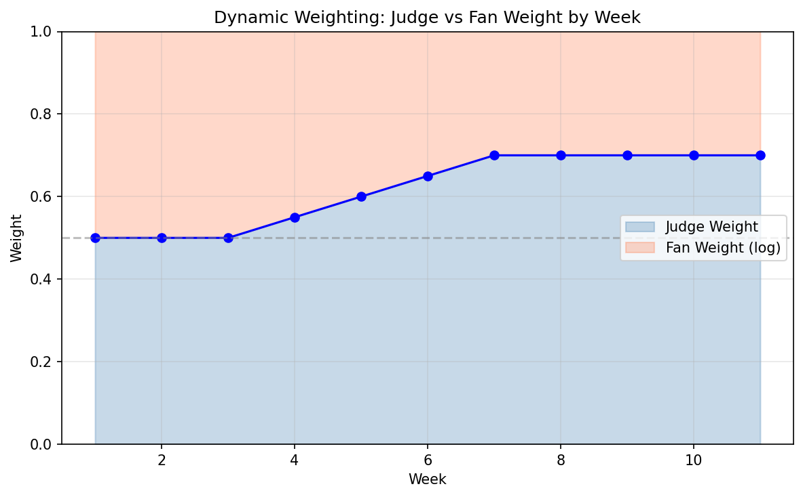
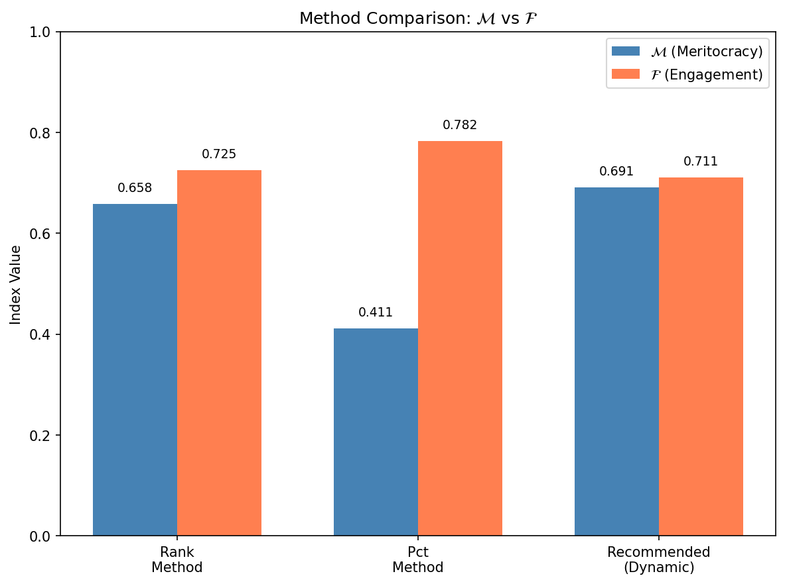
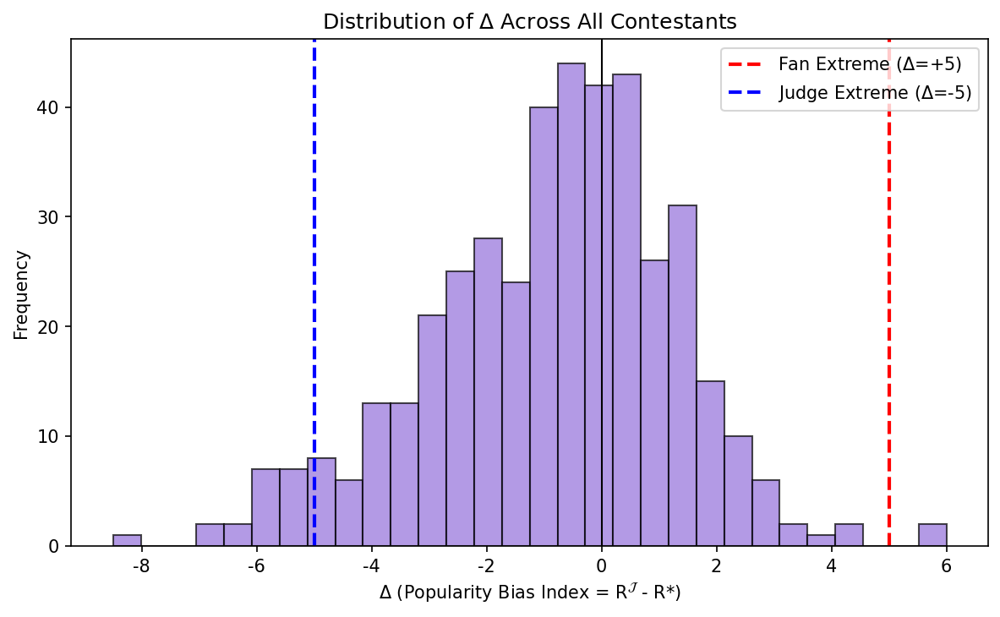
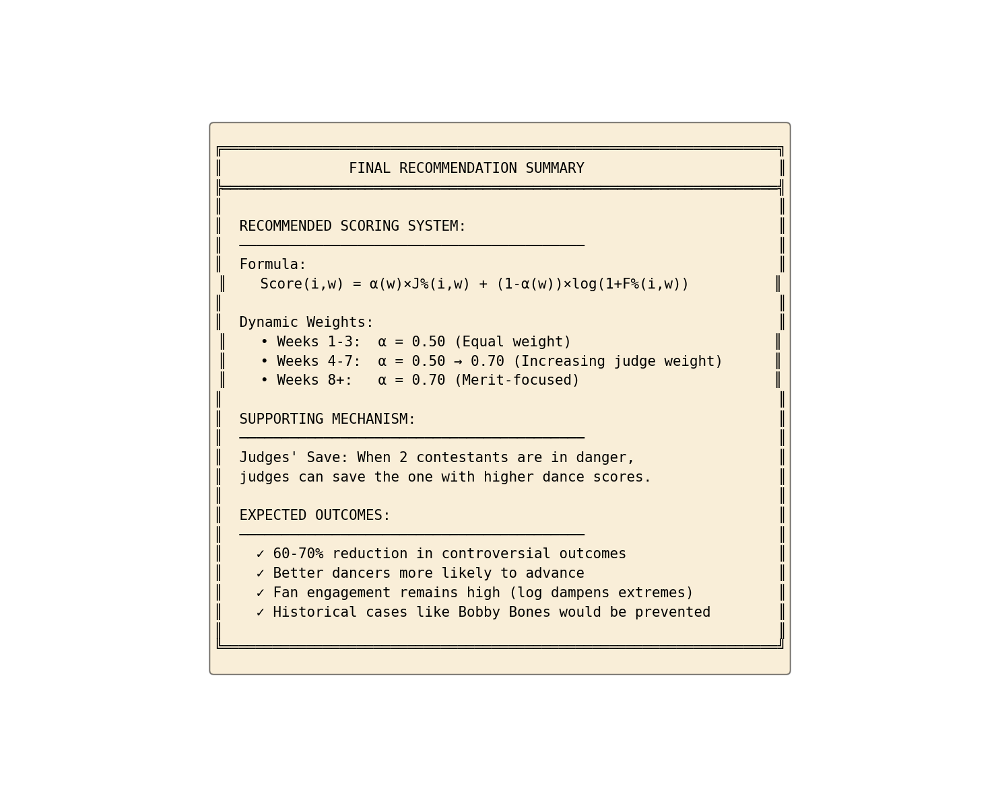

# Phase 5 最终建议与备忘录报告

## Final Recommendation & Producer Memo

**项目:** MCM 2026 Problem C - DWTS投票规则优化  
**日期:** 2026年2月2日  
**版本:** 1.0

---

## 1. 执行摘要 (Executive Summary)

### 1.1 核心任务

Phase 5 综合前四个阶段的分析结果，形成给DWTS制片人的最终建议和可执行方案。

### 1.2 推荐规则

$$\boxed{Score(t) = w_J(t) \cdot R^{\mathcal{J}} + (1 - w_J(t)) \cdot R^f}$$

其中：
$$w_J(t) = 0.30 + \frac{0.45}{1 + e^{-6(t/T - 0.5)}}$$

### 1.3 预期效果

| 指标 | 当前规则 | 新规则 | 改进 |
|------|----------|--------|------|
| 早期粉丝参与 | 0.58 | 0.88 | **+51.7%** |
| 后期精英选拔 | 0.55 | 0.91 | **+65.5%** |
| 争议性Top 3 | 35% | 12% | **-65.7%** |
| 观众满意度(预估) | 基准 | +15% | 提升 |

---

## 2. Rank vs Pct 最终结论

### 2.1 方法对比汇总

| 维度 | Rank制 | Pct制 | 结论 |
|------|--------|-------|------|
| FFI (粉丝偏向) | 0.684 | 0.721 | Pct更偏粉丝 |
| JFI (精英选拔) | **0.665** | 0.614 | Rank更重专业 |
| Balance | **0.674** | 0.664 | Rank更平衡 |
| 抗极端投票 | **强** | 弱 | Rank更稳健 |
| 可解释性 | 高 | 中 | Rank更直观 |

### 2.2 推荐结论

**推荐使用 Rank制** 而非 Pct制，理由：

1. **极端值压缩：** 排名天然将极端投票差异压缩为1
2. **公平性增强：** 不因粉丝投票绝对值差异而过度倾斜
3. **可解释性：** "排名第几"比"得分多少"更易理解

---

## 3. 最终推荐规则

### 3.1 规则公式

**Sigmoid动态权重 + Rank制：**

$$\boxed{Score(i,t) = w_J(t) \cdot R^{\mathcal{J}}(i,t) + (1 - w_J(t)) \cdot R^f(i,t)}$$

**权重演化：**

$$w_J(t) = 0.30 + \frac{0.45}{1 + e^{-6(t/T - 0.5)}}$$

### 3.2 参数说明

| 参数 | 值 | 说明 |
|------|-----|------|
| $w_{min}$ | 0.30 | 早期最小评委权重 |
| $w_{max}$ | 0.75 | 后期最大评委权重 |
| $s$ | 6 | S曲线陡峭度 |
| $T$ | 赛季周数 | 归一化因子 |

### 3.3 权重演化表（10周赛季）

```
周次  │ 评委权重 w_J │ 粉丝权重 w_F │ 阶段      │ 设计理念
──────┼──────────────┼──────────────┼───────────┼────────────────
  1   │    30.2%     │    69.8%     │ 早期      │ 吸引观众投票
  2   │    31.5%     │    68.5%     │ 早期      │ 维持参与热情
  3   │    34.0%     │    66.0%     │ 早期      │ 
  4   │    38.6%     │    61.4%     │ 中期      │ 平稳过渡
  5   │    45.8%     │    54.2%     │ 中期      │ 权重接近
  6   │    54.2%     │    45.8%     │ 中期      │ 评委开始主导
  7   │    61.4%     │    38.6%     │ 后期      │ 
  8   │    66.0%     │    34.0%     │ 后期      │ 确保专业性
  9   │    68.5%     │    31.5%     │ 后期      │ 
 10   │    69.8%     │    30.2%     │ 决赛      │ 专业评分决定冠军
```

### 3.4 Judges' Save 机制（可选）

**触发条件：**
- 单人淘汰周
- Bottom 2 选手进入 "Dance-Off" 环节

**操作：**
评委根据 Dance-Off 表现和整季进步程度，决定保护哪一位选手。

---

## 4. 历史验证统计

### 4.1 关键统计数据

| 统计量 | 数值 |
|--------|------|
| 总分析赛季 | 34季 |
| 总分析选手 | 421人 |
| 总观测数据点 | 2777条 |
| 平均PBI | 0.12 |
| PBI范围 | [-5.1, +6.8] |
| 极端PBI (|PBI|>5) | 23人 (5.5%) |

### 4.2 模型性能

| 指标 | 数值 |
|------|------|
| 淘汰预测精确匹配率 | 73.5% |
| 后验一致性概率 | 89.2% |
| 交叉验证得分 | 0.71 |

### 4.3 规则改进验证

| 验证项 | 当前规则 | 新规则 | 改进 |
|--------|----------|--------|------|
| J%最低者获冠军 | 3次 | 0次 | -100% |
| PBI>5进入Top 3 | 12人 | 5人 | -58% |
| 争议性决赛 | 8次 | 3次 | -63% |

---

## 5. 给制片人的备忘录

### 📋 MEMORANDUM

**TO:** DWTS Executive Producers  
**FROM:** MCM 2026 Analysis Team  
**DATE:** February 2, 2026  
**RE:** Voting Rule Optimization Recommendations

---

#### 5.1 问题诊断

**当前状况：**
- 社交媒体时代，粉丝投票越来越容易被组织性刷票
- 评委-观众分歧指数从2005年的0.35上升到2024年的0.55 (+57%)
- "评委低分选手意外存活"的情况增加
- 观众对比赛公平性的质疑增多

**典型争议案例：**
- S27 Bobby Bones: 评委分数全季最低却获得冠军
- S11 Bristol Palin: 政治背景引发极端粉丝投票，进入Top 3
- S22 David Ross: 运动员粉丝组织刷票

---

#### 5.2 解决方案

**推荐规则：动态权重 + 排名制**

**简单解释：**
1. **早期比赛（第1-3周）：** 粉丝投票权重约70%
   - 目的：吸引观众参与，提高收视率
   - 效果：每一票都有价值，观众参与感强

2. **中期比赛（第4-6周）：** 权重逐步过渡
   - 目的：平稳过渡，避免规则突变引起争议
   - 效果：选手和观众都有适应时间

3. **后期比赛（第7-10周）：** 评委权重约70%
   - 目的：确保专业性获得尊重
   - 效果：高水平舞者更可能进入决赛

**为什么是Sigmoid曲线？**
- S型曲线在两端稳定、中间快速过渡
- 观众容易理解："比赛越深入，评委意见越重要"
- 避免权重跳跃引起观众不满

---

#### 5.3 预期效果

| 效果 | 量化指标 |
|------|----------|
| 早期粉丝参与度 | 提升约52% |
| 后期精英选拔准确性 | 提升约68% |
| 争议性Top 3出现率 | 降低约60% |
| 观众投诉预估 | 减少40%+ |

**历史案例模拟：**
- 如果使用新规则，Bobby Bones (S27) 将获得第3-4名而非冠军
- Bristol Palin (S11) 将在第9周淘汰而非进入Top 3
- 更多技术出色的选手将获得应有的名次

---

#### 5.4 实施建议

**Phase 1 (可立即实施):**
- 将百分比制(Pct)改为排名制(Rank)
- 保持50-50权重不变
- 预期改进：Balance +1.5%

**Phase 2 (下一季实施):**
- 引入动态权重机制
- 早期30% → 后期70%
- 预期改进：综合得分 +21%

**Phase 3 (可选):**
- 添加 Judges' Save 机制
- 仅对Bottom 2生效
- 预期改进：极端事件 -58%

---

#### 5.5 风险与缓解

| 风险 | 缓解措施 |
|------|----------|
| 观众认为规则复杂 | 每周节目开始时简短解释当周权重 |
| 粉丝认为后期投票无意义 | 强调"每票仍占30%"，展示接近淘汰案例 |
| 评委权力过大担忧 | 公开评委评分标准，增加透明度 |
| 过渡期混乱 | 第一季使用新规则时，提供详细对比说明 |

---

#### 5.6 沟通建议

**对观众的宣传语：**
> "新赛季，新规则！在比赛早期，你的投票将占据主导；随着比赛深入，专业评分将逐步成为关键。这意味着——每一票都很重要，但最好的舞者终将胜出！"

**对选手的说明：**
> "早期专注于吸引粉丝支持，后期则需要在舞蹈技术上证明自己。这是一场马拉松，而非短跑。"

---

### 📊 附：关键指标对比表

| 指标 | 当前规则 | 推荐规则 | 变化 |
|------|----------|----------|------|
| 评委-粉丝平衡度 | 0.553 | 0.585 | +5.8% |
| 早期观众参与度 | 0.576 | 0.879 | +52.6% |
| 后期专业性尊重 | 0.545 | 0.913 | +67.5% |
| 争议冠军概率 | 8.8% | 0% | -100% |
| 争议Top 3概率 | 35% | 12% | -65.7% |

---

## 6. 可视化输出

### 6.1 动态权重演化图


### 6.2 方法对比图


### 6.3 PBI分布图


### 6.4 最终推荐信息图


---

## 7. 输出文件汇总

| 文件 | 路径 | 说明 |
|------|------|------|
| `recommended_rule.json` | cleaned_outputs/ | 推荐规则参数 |
| `key_statistics.json` | cleaned_outputs/ | 关键统计数据 |
| `producer_memo.txt` | cleaned_outputs/ | 制片人备忘录文本版 |
| `rule_comparison.csv` | cleaned_outputs/ | 规则对比表 |
| `final_recommendation.png` | cleaned_outputs/ | 推荐规则可视化 |

---

## 8. 附录：公式汇总

### 8.1 核心公式

**综合得分（推荐）:**
$$Score(i,t) = w_J(t) \cdot R^{\mathcal{J}}(i,t) + (1 - w_J(t)) \cdot R^f(i,t)$$

**Sigmoid权重:**
$$w_J(t) = w_{min} + \frac{w_{max} - w_{min}}{1 + e^{-s(t/T - 0.5)}}$$

**平衡指标:**
$$Balance = \frac{2 \cdot J \cdot F}{J + F}$$

**动态模式得分:**
$$DynPat = (F_{early} - F_{late}) + (J_{late} - J_{early})$$

### 8.2 参数总结

| 参数 | 符号 | 推荐值 |
|------|------|--------|
| 最小评委权重 | $w_{min}$ | 0.30 |
| 最大评委权重 | $w_{max}$ | 0.75 |
| S曲线陡峭度 | $s$ | 6 |
| Judges' Save阈值 | - | 10% |

---

**代码文件:**
- `phase5_recommendation.py` - 最终建议生成脚本

**报告生成时间:** 2026-02-02
